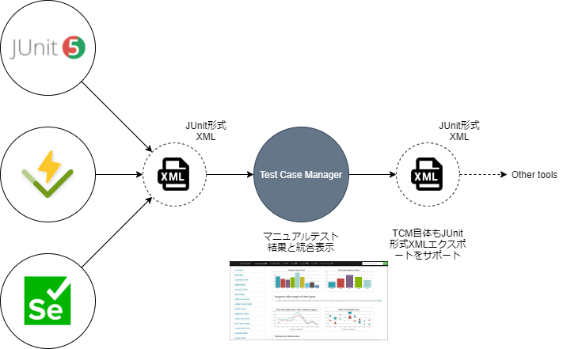

# 統合

手動テスト管理だけではなく, Vitest, Google Test, Seleniumのような自動テストツール結果も併せて結果を表示できるようにしたい。

JUnit xml形式がデファクトスタンダードとなっているのでそのxmlファイルを介してインポートを行う。また、TestCaseManager自体も手動テスト結果をJunit XML形式でレポート出力できるようにする。



```xml title="Junit xml"
<?xml version="1.0" encoding="UTF-8"?>
<testsuites time="15.682687">
    <testsuite name="Tests.Registration" time="6.605871">
        <testcase name="testCase1" classname="Tests.Registration" time="2.113871" />
        <testcase name="testCase2" classname="Tests.Registration" time="1.051" />
        <testcase name="testCase3" classname="Tests.Registration" time="3.441" />
    </testsuite>
    <testsuite name="Tests.Authentication" time="9.076816">
        <testsuite name="Tests.Authentication.Login" time="4.356">
            <testcase name="testCase4" classname="Tests.Authentication.Login" time="2.244" />
            <testcase name="testCase5" classname="Tests.Authentication.Login" time="0.781" />
            <testcase name="testCase6" classname="Tests.Authentication.Login" time="1.331" />
        </testsuite>
        <testcase name="testCase7" classname="Tests.Authentication" time="2.508" />
        <testcase name="testCase8" classname="Tests.Authentication" time="1.230816" />
        <testcase name="testCase9" classname="Tests.Authentication" time="0.982">
            <failure message="Assertion error message" type="AssertionError">
                <!-- Call stack printed here -->
            </failure>
        </testcase>
    </testsuite>
</testsuites>
```